# PVLI Through The Window

### Documento de diseño de videojuego

# Programación de Videojuegos en Lenguajes Interpretados :: Grupo 2
# _____________________PeekGamesUCM_____________________ #
Autores:

* Dewei Chen (deweiche@ucm.es) 

* Menggen Hu (menhu@ucm.es) 

* Javier Muñoz García(javimuno@ucm.es)

* Elena Robert Núñez (elenrobe@ucm.es)

<table>
<tr>
    <td colspan = "2"> <b>Resumen:</b> Juego de gestión de recursos con narrativa basado en la famosa película “La ventana indiscreta” de  Hitchcock. El jugador podrá elegir entre estar dentro de su cuarto o mirar por la ventana para observar a sus distintos vecinos mediante el uso de prismáticos o micrófonos ocultos, en busca de desenmascarar a un posible asesino. </td>
        
    
</tr>
<tr>
    <td> <b>Géneros:</b> Narrativo, gestión, point and click </td>
    <td> <b>Modos:</b> Single Player </td>
        
    
</tr>
<tr>
    <td> <b>Público</b> objetivo: 
        Mayores de 16 (PEGI 16), todo género, España.
 </td>
    <td> <b>Plataformas:</b> Ordenador con navegador Chrome, teclado y ratón. </td>
        
    
</tr>
<tr>
    <td> <b>Cantidades:</b>

Escenarios: 5. ( El plano general del edificio de vecinos, y cada una de las 4 habitaciones de vecinos.)

Objetos: 33

Personajes: 5

 </td>
    <td> <b>Hitos:</b>

Fecha de propuesta del concepto: 13/09/2021

Fechas de pre-producción:28/09/2021

Fechas de producción:25/10/2021

Fecha de lanzamiento:21/12/2021
 </td>
        
    
</tr>

</table>

### Descripción
Se trata de un juego estilo “Point and Click” en el cual el jugador, que encarna a un investigador de sucesos, se interesa por la muerte de un niño en un colegio, pero a medida que ahonda en esta investigación irá descubriendo que la trama se vuelve más compleja. Irán pasando la semana y el jugador se hará a sí mismo preguntas relacionadas con el caso que deberá de ser capaz de responder con la información que obtenga a lo largo del día. Para obtener esta información, deberá usar los objetos a su disposición, y mecánicas habilitadas para, pasados los 5 días haber podido descubrir qué ha ocurrido verdaderamente en el vecindario.

### Versiones del documento

### Tabla de contenidos

1. [Aspectos generales](#aspectosgenerales)
    1. [Relato breve](#relatobreve)
2. [Menús y modos de juego](#menusmodos)
    1. [Configuración](#configuracion)
    2. [Interfaz y control](#interfazControl)
3. [Jugabilidad](#jugabilidad)
    1. [Mecánica](#mecanica)
    2. [Dinámica](#dinamica)
    3. [Estética](#estetica)
4. [Contenido](#contenido)
    1. [Historia](#historia)
    2. [Niveles y eventos](#niveleseventos)
    3. [Personajes](#personajes)
    4. [Objetos](#objetos)
5. [Referencias](#referencias)
6. [UML](#uml)
7. [Plataformas de gestión y comunicación](#gestion)
8. [Web del juego](#juego)

### 1. Aspectos generales 
Through the window busca ofrecer una experiencia narrativa corta en la que el jugador pueda divertirse participando en un proceso de “investigación”. Mirando las ventanas de sus vecinos y recolectando información sobre los distintos objetos y conversaciones que puedan suceder en las habitaciones. El jugador deberá hacer uso de la información que consiga para extraer conclusiones y llegar a uno de los finales del juego.

#### Logotipo y portada del juego  

### Vista general  
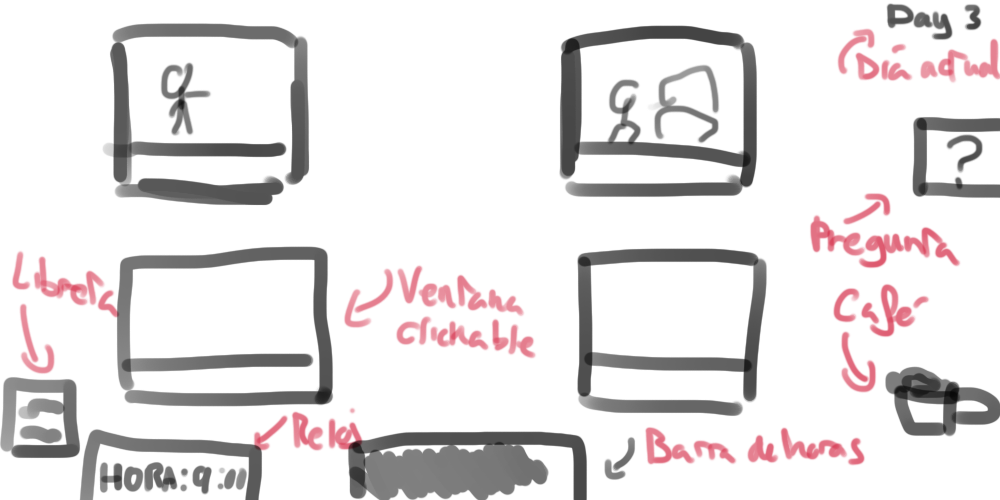
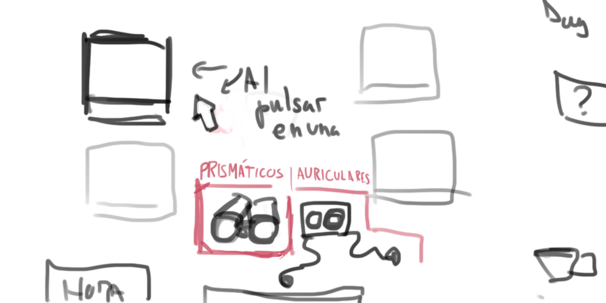
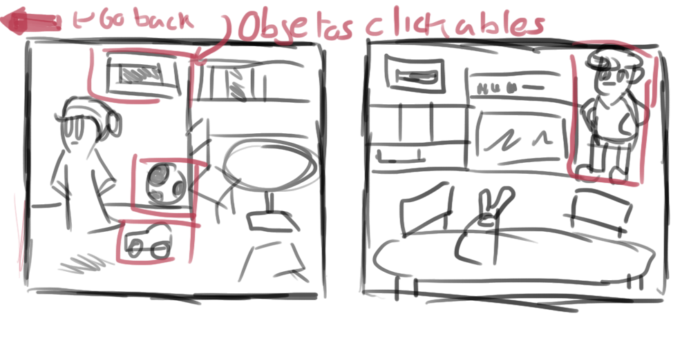
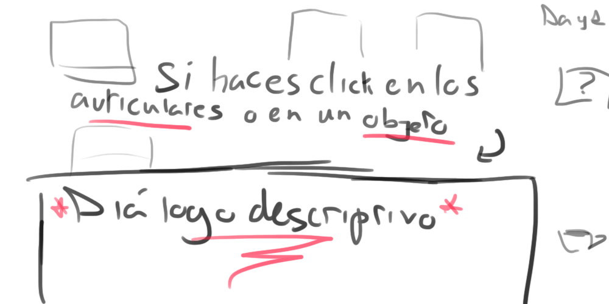

Los resultados finales de estos bocetos en el juego finalizado serían:
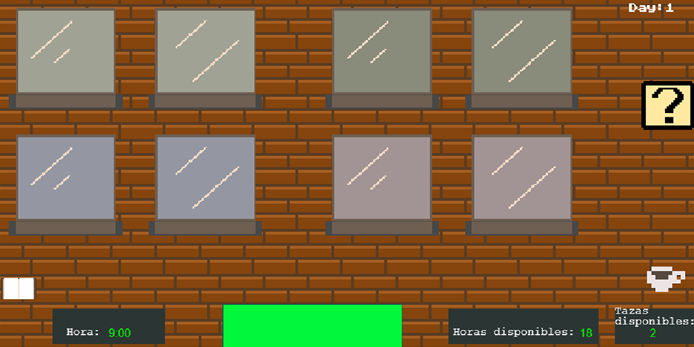
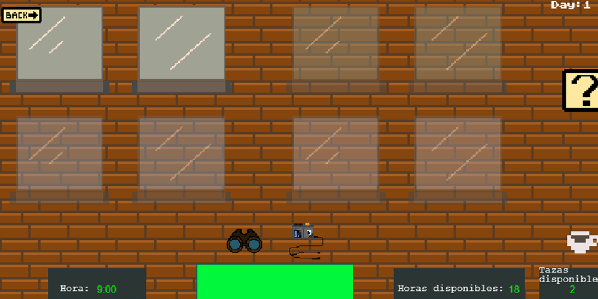
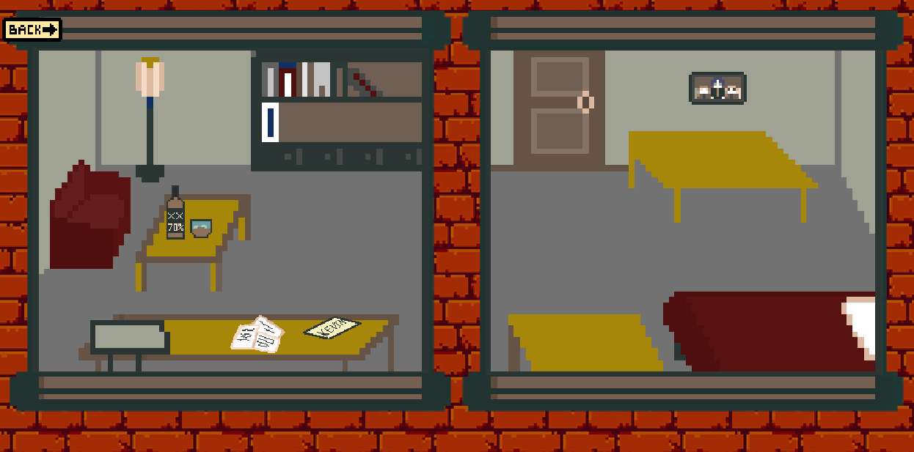
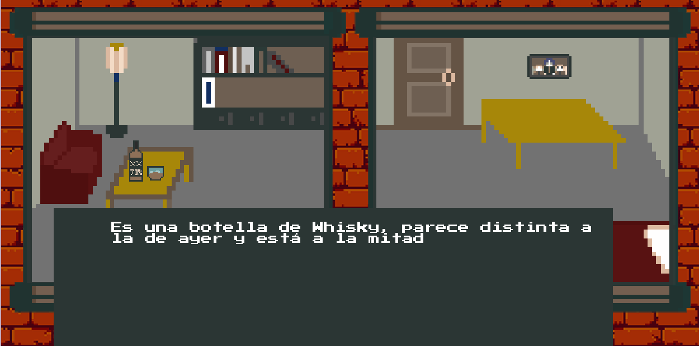

#### 1.1 Relato breve y parcial de una partida típica 
El jugador comienza la partida con una primera pregunta “¿Qué ha ocurrido con Kevin, el hijo de los Smith?” la cual podrá responder al final del primer día con la información que haya obtenido a lo largo del mismo, habida cuenta de que los eventos tienen lugar a lo largo de distintas franjas horarias del día, y si bien se repiten para que el jugador tenga varias oportunidades de dar con ellos y que además unos “invitan” a lógicamente deducir donde pueden ocurrir los que están relacionados con estos, el jugador puede tal vez perderse alguno.
Para obtener esa información puede usar varios objetos, los prismáticos con los que ver dentro de las casas de sus vecinos, los micrófonos que ha instalado en las puertas de las diferentes casas, y que escucha desde la suya a través de auriculares, le permitirán escuchar qué pasa dentro de los domicilios, y una libreta en la que quedará guardada la información que va descubriendo.
En esta libreta, se apuntarán en primer lugar estos eventos, observados y escuchados, y cuando junte dos de ellos, llegará a una deducción, y cuando junte dos deducciones llegará a una conclusión, con la cual podrá responder a esa pregunta que se le plantea al comienzo del día.
En caso de haber sido capaz o no de responder a esta pregunta se pasará al día siguiente.

### 2. Menús y modos de juego 
En el menú, encontramos una imagen de fondo y la opción de “Jugar”.
Habrá una música mientras el jugador se encuentre en esta pantalla.

#### 2.1 Configuración 
En principio no se puede configurar nada.

#### 2.2 Interfaz y control 
El juego principalmente se usará solo el ratón.

### 3. Jugabilidad 

#### 3.1 Mecánica 
**Cambio de escena.** El jugador parte de un plano general en el cual puede hacer click encima de una de las 4 ventanas que se le muestran. Al hacerlo aparecerán dos iconos, el de los prismáticos, con los cuales veremos con detalle la habitación, cambiando de escena, y el de los auriculares, mediante los cuales escucharemos el micrófono del piso en cuestión pero permaneciendo en la escena "general".

**Pregunta al comienzo del día:** Con el comienzo de cada día, el investigador al que encarna nuestro jugador se hará una pregunta, la cual tendrá que responder con la información obtenida a lo largo del mismo. Esta pregunta estará disponible durante todo el día, y se accederá a ella a través de un icono que muestra una interrogación en el plano general, debajo de ella, si hemos llegado a una conclusión ese día, se contestará automáticamente.

**Cuadros de texto:** Estos cuadros mostrarán la descripción de los eventos que el jugador "escucha" (en este caso lee), así como la descripción de los objetos en los que pulsa en cada una de las habitaciones.

**Prismáticos.** Al seleccionar una ventana en el plano general del edificio, y elegir la opción de usar los prismáticos, el jugador puede ver lo que ocurre dentro, lo que supondrá el avance de 1 hora en el tiempo al volver a la vista general. Mediante el uso de prismáticos puedes interaccionar con objetos que veas dentro de los pisos, los cuales estarán resaltados para servir de guía al jugador. En caso de que uno de esos objetos aporte una información relevante al jugador, esta se apuntará en la libreta automáticamente.

**Auriculares:** Al hacer click encima de uno de los pisos, y a continuación encima del icono de los auriculares, podremos escuchar el micrófono correspondiente a la ventana previamente pulsada. Los auriculares nos permiten tener acceso a los eventos de carácter sonoro y al igual que los prismáticos, su uso hará que pase una hora después de haber escuchado por ellos. En caso de tener lugar un evento relevante durante su uso, este se apuntará en nuestra libreta.

**Paso de tiempo/ Barra de horas disponibles**  El tiempo transcurre a medida que el jugador bien hace uso de los prismáticos para observar los distintos pisos, bien hace uso de los auriculares para escuchar lo que ocurre dentro de ellos a razón de 1 hora por uso.
Los días comienzan a las 9:00 de la mañana, y el jugador es capaz de estar despierto en un inicio hasta las 03:00 de ese mismo día, pero con el consumo de las 2 tazas de café de que dispone al día puede ampliar este límite a las 5:00. Es a lo largo de esta franja horaria de 18 o de 20 horas, donde tienen lugar los eventos visuales y auditivos.

Si el jugador llega a las 3:00, se le abrirá automáticamente la pregunta del día, desde la cual podrá volver atrás para tomar café o usar la libreta si todavía quiere, o pasar al día siguiente (explicado con más detalle en apartados inferiores).

**Tomar café.** El jugador puede consumir dos tazas de café al dia. El consumo de estas lo que hace es prolongar en una hora por taza la cantidad de horas disponibles o durante las cuales está despierto a lo largo del día.

**Libreta de información:**  Es una agenda en la cual se va apuntando de manera automática la información relevante obtenida mediante la observación con los prismáticos y el uso de los auriculares. 

En la libreta irá apareciendo lo observado por el jugador, cuando la información sea relevante y diferenciados por colores dependiendo de si lo has observado o escuchado en un piso u otro.
Estas observaciones podrán juntarse a modo de dupla, clicando en los dos cuadros de textos, y en caso de haber una sinergia entre ellos darán pie a una deducción.

De la misma manera, cuando tengamos varias deducciones podremos repetir la operación, y de estar interrelacionadas aparecerá la conclusión de juntarlas; Esta conclusión es el objeto que buscamos para responder a las preguntas que se nos formulan al comienzo de cada día.

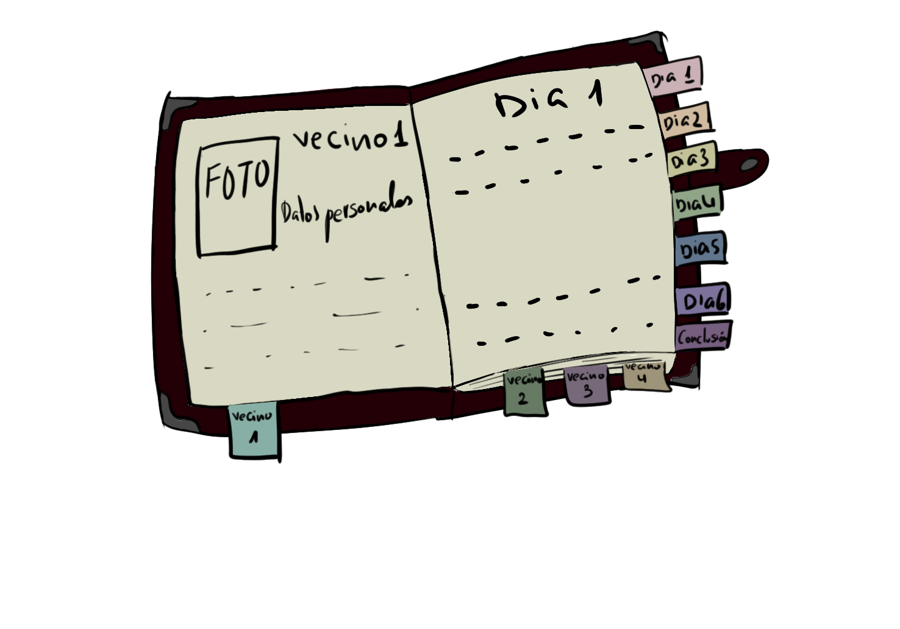

**Eventos:** Los eventos son información de valor que el jugador puede apuntar en la libreta. Pueden ser de dos tipos, visuales o auditivos, aunque al escribirlos en la libreta se comportan igual.

Los eventos visuales ocurren al hacer click en aquellos objetos que se resaltan al pasar el cursor por encima en cada una de las habitaciones, tras haber activado la función de los prismáticos.

Tras hacer click, salta un cuadro de diálogo con información y se pondrá un resumen escueto de ella en la libreta, funcionando a modo de “evento”. En caso de clickar en un mismo objeto varias veces, volverá a saltar el cuadro de texto, pero no se volverá a apuntar en la libreta. Hay objetos que no se apuntan en la libreta porque no van a servir para extraer conclusiones y juntarlos con otros.

Los eventos auditivos saltan como un cuadro de texto al hacer click en una de las habitaciones y elegir la opción de auricular. Hemos de tener en cuenta que para que el jugador pueda llegar a enterarse de estos eventos abarcarán varias horas consecutivas, de tal forma que la conversación, o el diálogo será distinto, pero el resumen a modo de evento que se apunta en la libreta será el mismo. De la misma manera, se escucharán también diálogos, conversaciónes o sonidos que el protagonista percibe que no tienen información relevante y por tanto no se apuntarán en la libreta.

**Pregunta del día:** Para cada día, el jugador podrá acceder al icono de la pregunta del día, donde se le notifica una pregunta que está relacionada con eventos de ese día, de modo que sirva de guía para el jugador. Al final del día, cuando el jugador se va a dormir, vuelve a aparecer en pantalla un texto con la pregunta del día. Si el jugador ha llegado a la conclusión que responde la pregunta se mostrará automáticamente. Tendrá la opción de pasar de día.

**Acusar:** Es la herramienta final del juego. Cuando acaban los días, el jugador debe acusar a uno de los vecinos de haber asesinado a William. De acertar cual ha sido, el jugador habrá ganado y se le contará la historia completa de todo lo que ha ido pasando. En el caso de fallar y no descubrir quien ha sido, el jugador pierde el juego y se le cuenta la historia del vecino al que ha acusado. En cualquier caso, esta acusación funciona como respuesta libre y se notificará al jugador su "puntación" en forma de decirle cuántas conclusiones ha obtenido a lo largo del juego.

**Diferentes finales:** Según quien acuse el jugador, saldrá un texto final correspondiente al que haya acusado.

#### 3.2 Dinámica 

El jugador, a través de la recolección de eventos puede llegar a la respuesta de las preguntas de cada día. De cara a contestar la cuestión final tenemos que haber sido capaces de encontrar información concluyente a lo largo del gameplay, de tal manera que el jugador gana si acusa al asesino, en este caso, la Señora Cooper, y pierde en caso de acusar a cualquiera de los otros vecinos.

Durante el transcurso de los distintos días el jugador irá recopilando información que lo lleve a un desenlace u otro.     

Los finales serán los siguientes:
1. El jugador pierde la partida al acusar a la pareja Smith de intentar asesinar al profesor William Stanford y se le cuenta la historia subyacente del porqué de este intento de homicidio.

2. El jugador gana la partida al acusar a la Sra. Edna Cooper del asesinato del profesor William Stanford y se le cuenta la historia completa de como ha llegado a pasar eso.

3. El jugador pierde la partida al acusar al detective Charles Doyle de tráfico de drogas y corrupción policial al no declarar las drogas incautadas y venderlas de manera ilegal por la noche.

A lo largo del juego esperamos que el jugador desarrolle ciertas estrategias, dentro de las cuales cabrá destacar las siguientes:

- Gestión del tiempo disponible para realizar acciones a lo largo del día, tanto de recolección de información como de observación de eventos relacionados.

- Desarrollo de una deductiva lógica que le permita relacionar eventos que tengan una sinergia significativa entre ellos, de tal manera que contengan  la información que responda a cada pregunta a lo largo del gameplay.

#### 3.3 Estética 
Para la representación de los escenarios y los personajes usaremos un estilo pixel art, con una paleta de colores poco saturados, para dar una sensación de antigüedad. Esta paleta de colores será mayormente marrón o gris, y se romperá en cada una de las habitaciones, teniendo la de la señora Cooper un azul más vibrante en algunos objetos, la de Charles teniendo verde y la de William con rojo, quedándose la de la pareja de los Smith más apagada por el luto por el que pasan.

### 4. Contenido 

#### 4.1 Historia 
**Protagonista:** El jugador encarga al investigador Thomas Seeker, el cual, al leer en un periódico que un niño se había suicidado en en colegio, decide poner su intelecto en juego para obtener más información al respecto sin ser consciente de que al indagar en este hecho, descubrirá que los vecinos de ese edificio esconden secretos que no querrían ser revelados.

**Vecino 1 :**  La familia Smith está compuesta por John y Sarah Smith, una pareja que en el momento en el que se desarrolla el juego están de luto por su difunto hijo pequeño, Kevin. Un mes antes de la muerte de William y de los acontecimientos del juego, Kevin Smith sufre acoso escolar, circunstancia que su profesor, el fallecido William, no da importancia, resultando en el suicidio del pequeño. A pesar de su pasividad ante la situación, no hubo consecuencias legales de ningún tipo contra William, causando un tremendo dolor a los padres del pequeño y dando un posible motivo para asesinar a William. John y Sarah consiguen al principio del juego un veneno que intentarán hacer ingerir a William camuflado en una comida que preparan para él sin embargo, este se encuentra en la escalera con Candy, el perro de la señora Cooper, al cual se lo dará para comer y desgraciadamente este morirá.
Los Smith, al no tener éxito en su primer intento de envenenamiento lo intentarán otra vez días después entrando en casa de William para envenenar toda la comida que encuentran dentro del piso del profesor.

**Vecino 2 :** La Señora Edna Cooper llevaba una vida tranquila, en compañía de sus numerosos gatos y Candy, su perro, hasta que un día encuentra muerto a este último, tras haber ingerido una suculenta comida que contenía veneno. Esta comida, que había preparado la pareja Smith para William acaba llegando al perro, ya que el profesor acostumbraba a darle de comer con frecuencia.
Tras este evento la Señora Cooper, consuma su venganza al invitar al profesor a tomar té, el cual está adulterado con pastillas tranquilizantes, y este, tras consumirlo y quedar adormecido es posteriormente apuñalado numerosas veces con las agujas de tejer de la anciana.
Al ser difícil para una persona de su edad sacar el cadáver, la anciana lo descuartiza con una motosierra y mezclándolo con la comida de sus gatos hace que estos vayan dando cuenta del cuerpo.

**Vecino 3:**  El detective Charles Doyle, cansado de su vida de investigador y la poca remuneración que consigue con ello, decide tomar la vía rápida y vender las drogas y sustancias de dudosa procedencia que incautó en sus redadas y venderlas por su cuenta, siendo un negocio mucho más lucrativo.
Charles tiene montado su pequeño negocio clandestino en el callejón aledaño al edificio, al cual baja numerosas veces a lo largo de la noche para comerciar con su mercancía. Sin embargo, William ha descubierto su negocio, de modo que chantajea a Charles progresivamente. Con el aumento de la cantidad de amenazas, Charles no tiene dinero suficiente para hacer frente al soborno, de manera que decide chantajear a la familia Smith los cuales le habían comprado el veneno que intentarían usar para asesinar al profesor en un principio. No obstante, William no se da por satisfecho con ello y continúa con el chantaje esto da pie a la discusión en el pasillo del edificio resultando en que el detective empuja al profesor por la escalera. Posteriormente, creyéndolo muerto, entra en casa de William para recuperar su dinero.

**Vecino 4:**  El profesor William Scott ha ejercido como docente durante muchos años a lo largo de su vida, perdiendo la pasión por su trabajo a lo largo de los años. Tanto ha sido así, que sabiendo que uno de sus alumnos, Kevin, el hijo de los Smith, estaba siendo víctima de acoso escolar no hizo nada, ni tan siquiera hablar con sus padres sobre ello, los cuales son vecinos suyos.
Tras el suicidio del niño, William ahoga su culpabilidad en alcohol y drogas por las tardes y las noches.
Asimismo William, por un lado dará de comer, sin saberlo, la comida envenenada que los Smith le habían preparado, conyevando esto a que la señora Cooper lo acabe matando y descuartizando; por otro lado, el profesor descubre el pequeño negocio clandestino de drogas de su vecino Charles, lo que derivará en un agresivo chantaje y un aún más agresivo enfrentamiento entre ambos, acabando por empujar Charles al profesor escalera abajo.

#### 4.2 Niveles o eventos 
En nuestro juego no existirán niveles, sino que tendrán lugar eventos a lo largo de 5 días de la semana.
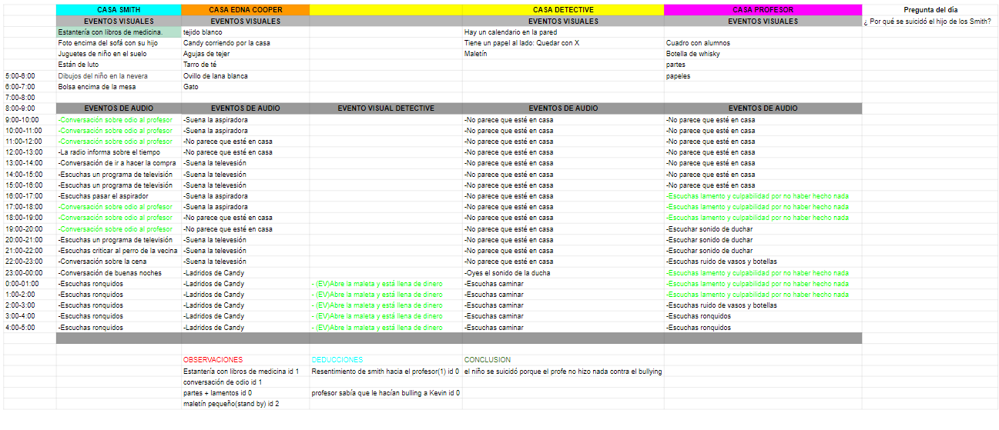
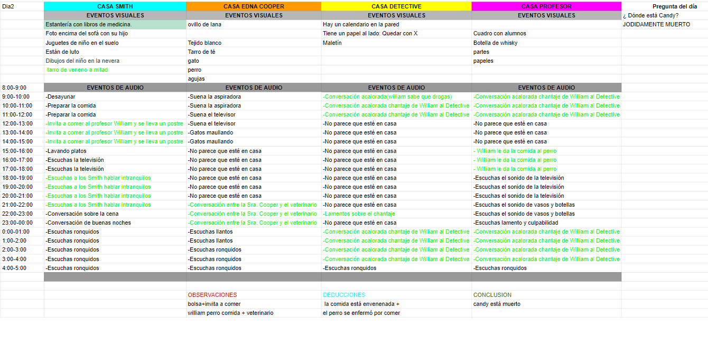
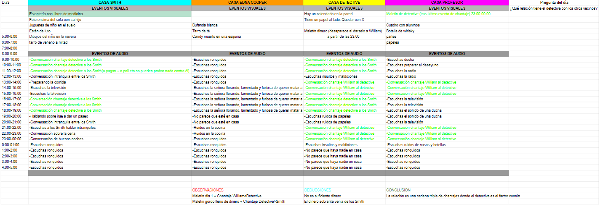
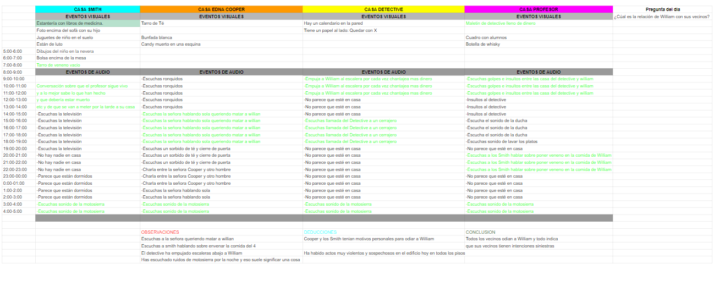
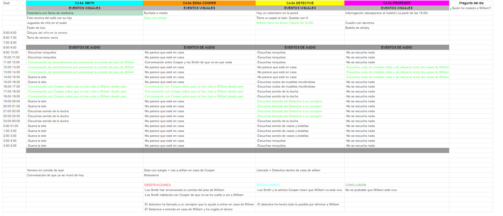

[Eventos y dialogos](EventosYdialogos.md)         
[Enlace al excel](https://docs.google.com/spreadsheets/d/1pbKhvv9ovA54C8Tk_gWiwxWM6B4BLxL_j9Yffmv4mjI/edit#gid=1065729110)    

#### 4.3 Personajes 
Protagonista: Thomas Seeker
Vecino 1: Padre:John Smith Madre: Sarah Smith  Hijo: Kevin Smith  
Vecino 2: Señora Edna Cooper  Perro: Candy  
Vecino 3: Detective Charles Doyle  
Vecino 4: Profesor William Scott.  
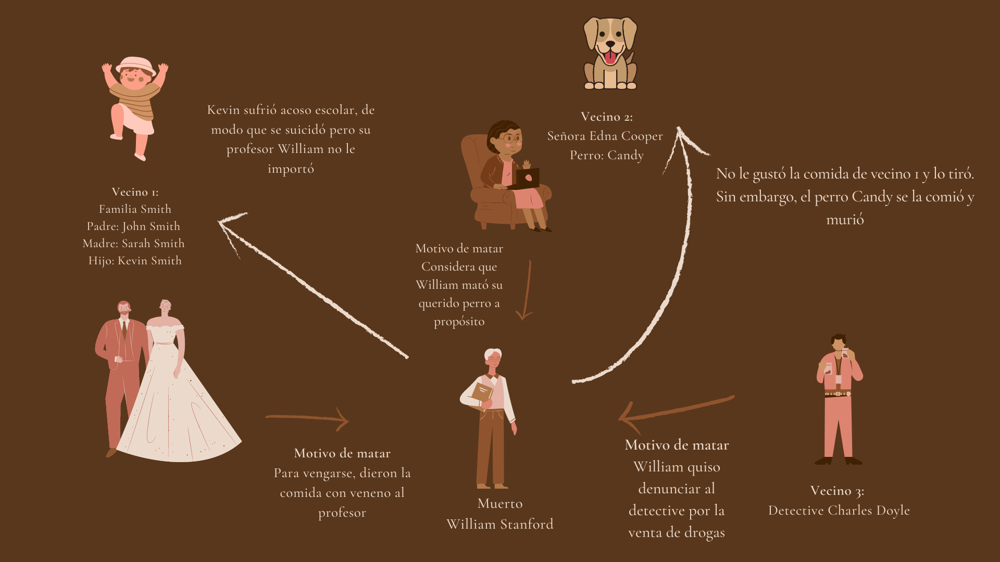

#### 4.4 Objetos 
**Prismáticos:** Sirven para mirar a través de las ventanas a los distintos vecinos. Con el uso de los mismos puedes observar objetos resaltados que aporten información que usar para hacer deducciones de lo que está pasando.

**Icono Pregunta del Día:** Icono que te lleva a la pregunta del día, donde existirá alli el botón de pasar de día.

**Auriculares:** Dispositivo que se usa para escuchar los micrófonos. No se pueden usar de forma simultánea a los prismáticos.

**Libreta de información:** Libreta a la que tiene acceso el jugador en cualquier momento, allí se apuntan toda la información, observaciones, deducciones y conclusiones que ha ido obteniendo el jugador.

**Café:** Una bebida cuya función es poder aguantar más horas despierto.
### 5. Referencias 

- *“La ventana indiscreta”* - Alfred Hitchcock
- *“Stardew Valley”*
- *“Asesinato en el orient express”* - Agatha Christie
- *“Who is the murderer”*- Programa de TV
- *“Do not feed the monkeys”*
- *“The beholder”*
- *“Five nights at Freddy’s”*
- *Diagrama de la relación* - Canva

### 6. UML 

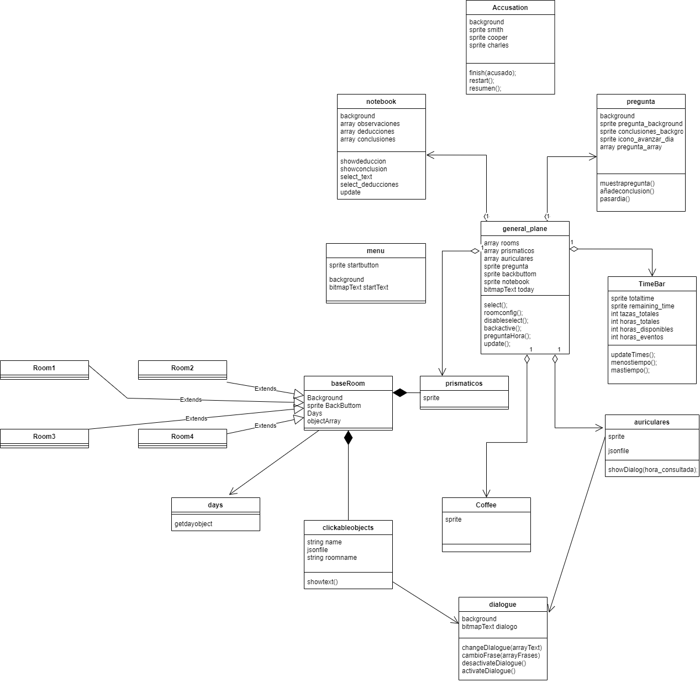

[Enlace al uml](https://app.diagrams.net/#G1fGQLV-oCemIR7E3TGnCeQJ6fHdor2XmO)  

### 7. Plataformas de gestión y comunicación 

Como plataforma de gestión se ha utilizado Pivotal Tracker, una herramienta para el desarrollo de software siguiendo las metodologías ágiles. 

Como métodos de comunicación se han utilizado WhatsApp (para preguntar dudas a miembros del equipo y acordar reuniones) y Discord, para hacer las susodichas reuniones en el canal de voz.

### 8. Enlace a la web del juego 

[Enlace a la página web](https://pvli2021-grupo2.github.io/PVLI/) 