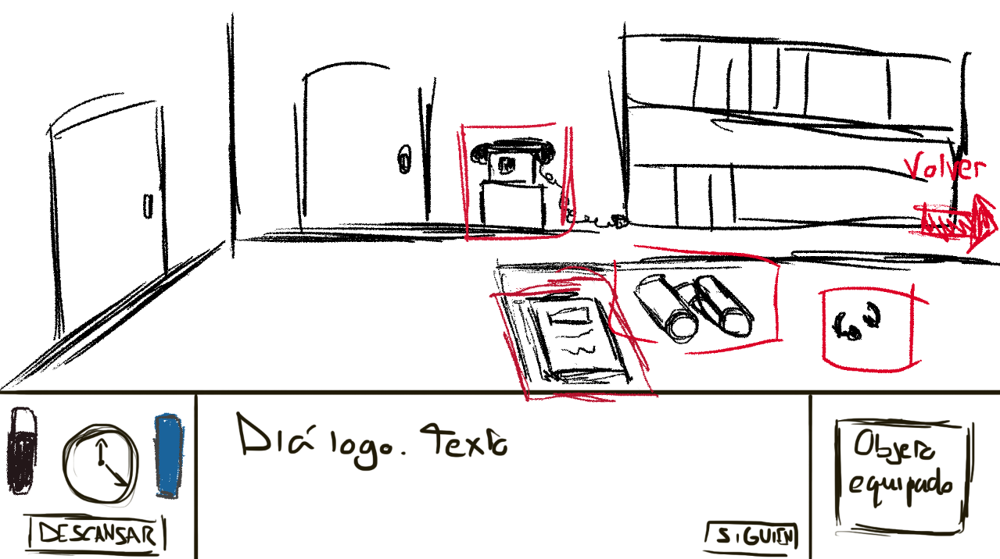
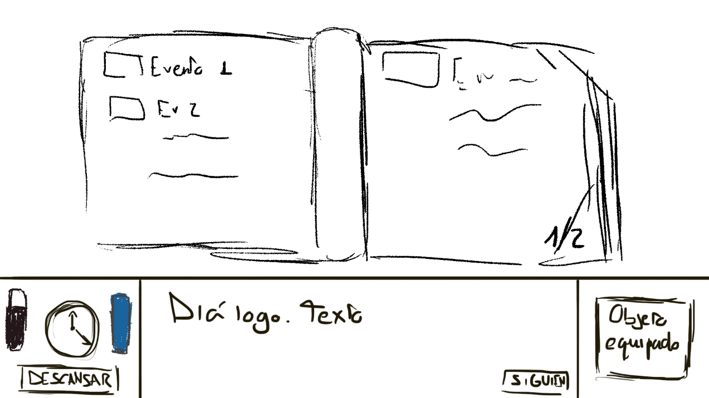
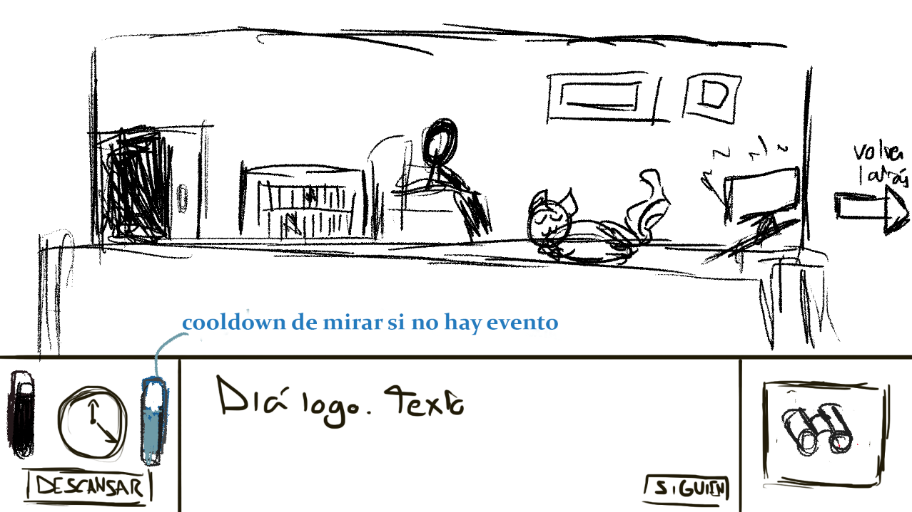
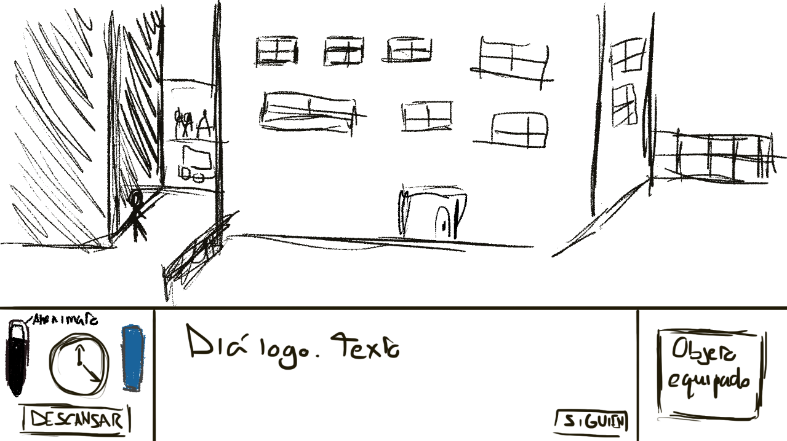

# PVLI Through The Window

### Documento de diseño de videojuego

Autores:

* Dewei Chen (deweiche@ucm.es) 

* Menggen Hu (menhu@ucm.es) 

* Javier Muñoz García(javimuno@ucm.es)

* Elena Robert Núñez (elenrobe@ucm.es)

<table>
<tr>
    <td colspan = "2"> <b>Resumen:</b> Juego de gestión de recursos con narrativa basado en la famosa película “La ventana indiscreta” de  Hitchcock. El jugador podrá elegir entre estar dentro de su cuarto o mirar por la ventana para observar a sus distintos vecinos mediante el uso de prismáticos o micrófonos ocultos, en busca de desenmascarar a un posible asesino. </td>
        
    
</tr>
<tr>
    <td> <b>Géneros:</b> Narrativo, gestión, point and click </td>
    <td> <b>Modos:</b> Single Player </td>
        
    
</tr>
<tr>
    <td> <b>Público</b> objetivo: 
        Mayores de 16 (PEGI 16), todo género, España.
 </td>
    <td> <b>Plataformas:</b> Ordenador con navegador Chrome, teclado y ratón. </td>
        
    
</tr>
<tr>
    <td> <b>Cantidades:</b>

Escenarios: 7. (La habitación por dentro, el plano general del edificio de vecinos, callejón y cada una de las 4 habitaciones de vecinos.)

Objetos: 5

Personajes: 5

 </td>
    <td> <b>Hitos:</b>

Fecha de propuesta del concepto: 13/09/2021

Fechas de pre-producción:28/09/2021

Fechas de producción

Fecha de lanzamiento
 </td>
        
    
</tr>

</table>

### Descripción
Se trata de un juego estilo “Point and Click” en el cual el jugador, que encarna a un investigador de sucesos, se interesa por la muerte de un niño en un colegio, pero a medida que ahonda en esta investigación irá descubriendo que la trama se vuelve más compleja. Irán pasando la semana y el jugador se hará a sí mismo preguntas relacionadas con el caso que deberá de ser capaz de responder con la información que obtenga a lo largo del día. Para obtener esta información, deberá usar los objetos a su disposición, y mecánicas habilitadas para, pasados los 7 días haber podido descubrir qué ha ocurrido verdaderamente en el vecindario.

### Logotipo y portada del juego

### Versiones del documento

### Tabla de contenidos

1. [AspectosGenerales](#aspectosgenerales)
    1. [RelatoBreve](#relatobreve)
2. [MenúsModosDeJuego](#menusmodos)
    1. [Configuracion](#configuracion)
    2. [InterfazControl](#interfazControl)
3. [Jugabilidad](#jugabilidad)
    1. [Mecánica](#mecanica)
    2. [Dinámica](#dinamica)
    3. [Estética](#estetica)
4. [Contenido](#contenido)
    1. [Historia](#historia)
    2. [NivelesEventos](#niveleseventos)
    3. [Personajes](#personajes)
    4. [Objetos](#objetos)
5. [Referencias](#referencias)

### 1. Aspectos generales 
Through the window busca ofrecer una experiencia narrativa corta en la que el jugador pueda divertirse participando en un proceso de “investigación”. Mirando las ventanas de sus vecinos y recolectando información sobre los distintos objetos y conversaciones que puedan suceder en las habitaciones. El jugador deberá hacer uso de la información que consiga para extraer conclusiones y llegar a uno de los finales del juego.
#### Logotipo y portada del juego  

### Vista general  

#### 1.1 Relato breve y parcial de una partida típica 
El jugador comienza la partida con una primera pregunta “¿Qué ha ocurrido con Kevin, el hijo de los Smith?” la cual deberá responder al final del primer día con la información que haya obtenido a lo largo del mismo, habida cuenta de que los eventos tienen lugar a lo largo de distintas franjas horarias del día, y si bien se repiten para que el jugador tenga varias oportunidades de dar con ellos y que además unos “invitan” a lógicamente deducir donde pueden ocurrir los que están relacionados con estos, el jugador puede tal vez perderse alguno.
Para obtener esa información puede usar varios objetos, los prismáticos con los que ver dentro de las casas de sus vecinos, los micrófonos que ha instalado en las puertas de las diferentes casas, y que escucha desde la suya a través de auriculares, le permitirán escuchar qué pasa dentro de los domicilios, y una libreta en la que quedará guardada la información que va descubriendo.
En esta libreta, se apuntarán en primer lugar estos eventos, observados y escuchados, y cuando junte dos de ellos, llegará a una deducción, y cuando junte dos deducciones llegará a una conclusión, con la cual podrá responder a esa pregunta que se le plantea al comienzo del día.
En caso de no haber sido capaz de responder a esta pregunta el día se reiniciará, puesto que avanzar sin haber descubierto qué ha pasado, en líneas generales a lo largo del día es contraproducente para el gameplay.

### 2. Menús y modos de juego 
En el menú, encontramos un fondo que representa el plano general del edificio que observaremos durante el gameplay y las opciones de “Jugar”, “Créditos” y “Salir”.
Habrá una música de fondo mientras el jugador se encuentre en esta pantalla así como efectos sonoros que tendrán lugar cuando el jugador pase el cursor por encima de las distintas opciones o las seleccione.

#### 2.1 Configuración 
En principio no se puede configurar nada.

#### 2.2 Interfaz y control 
El juego principalmente se usará solo el ratón.

### 3. Jugabilidad 

#### 3.1 Mecánica 
**Cambio de escena.** El jugador puede ir de su habitación al plano general de edificios. (En caso de que tenga los prismáticos equipados, puede cambiar la escena para ver cada una de las habitaciones, o el callejón).

**Pregunta al comienzo del día:** Con el comienzo de cada día, el investigador al que encarna nuestro jugador se hará una pregunta, la cual tendrá que responder con la información obtenida a lo largo del mismo.

**Cuadros de texto:** Diálogos en los que se explica lo que sucede en los eventos, visuales o auditivos.

**Prismáticos.** Al tenerlos equipados y seleccionar una ventana en el plano general del edificio, el jugador puede ver lo que ocurre dentro, lo que supondrá el avance de 1 hora en el tiempo al volver a la vista general. Mediante el uso de prismáticos puedes interaccionar con objetos que veas dentro de los pisos, los cuales estarán resaltados para servir de guía al jugador. En caso de que uno de esos objetos aporte una información relevante al jugador, esta se apuntará en la libreta automáticamente. 

**Paso de tiempo/ Barra de horas disponibles**  El tiempo transcurre a medida que el jugador bien hace uso de los prismáticos para observar los distintos pisos, bien hace uso de los auriculares para escuchar lo que ocurre dentro de ellos a razón de 1 hora por uso.
Los días comienzan a las 9:00 de la mañana, y el jugador es capaz de estar despierto en un inicio hasta las 00:00 de ese mismo día. 
Los eventos que tendrán lugar tanto visuales como auditivos ocurren desde las 9:00 de un día hasta las 4:00 del día siguiente.

**Tomar café.** El jugador puede consumir una taza de café a lo largo del día para aguantar 2 horas más despierto, pudiendo tomar un máximo de dos cafés por día.

**Auriculares:** Los usaremos para escuchar los diferentes micrófonos que tenemos instalados en las puertas de las viviendas de nuestros vecinos. Los auriculares nos permiten tener acceso a los eventos de carácter sonoro y al igual que los prismáticos, su uso hará que pase una hora después de haber escuchado por ellos. En caso de tener lugar un evento relevante durante su uso, este se apuntará en nuestra libreta.

**Libreta de información**  En la cual se va apuntando de manera automática la información relevante obtenida mediante la observación con los prismáticos y el uso de los auriculares. 
Una de las secciones contiene los perfiles de cada uno de los inquilinos de los pisos. 
En la libreta irá apareciendo lo observado por el jugador, cuando la información sea relevante y diferenciados por colores dependiendo de si lo has observado o escuchado en un piso u otro.
Estas observaciones podrán juntarse a modo de dupla, mediante un “click and drop” en un cuadro de texto vacío bajo la libreta, y en caso de haber una sinergia entre ellos darán pie a una deducción.
De la misma manera, cuando tengamos varias deducciones podremos repetir la operación, y de estar interrelacionadas aparecerá la conclusión de juntarlas; Esta conclusión es el objeto que buscamos para responder a las preguntas que se nos formulan al comienzo de cada día.
La libreta está organizada en dos secciones, a las que accedemos a través de pestañas.
En la primera tenemos la información de los perfiles de los vecinos.
En la segunda las observaciones, deducciones y conclusiones, para que sea fácil para el jugador, teniéndolas todas a la vista poder juntarlas de manera lógica.

#### 3.2 Dinámica 

A lo largo del juego la recolección de eventos importantes que permitan al jugador deducir la trama de cada uno de los pisos será fundamental y llegará a desbloquear distintos finales, algunos con un resultado positivo, digamos “habiendo ganado” por haber descubierto alguno de los hilos argumentales al completo, y otros finales en los que el jugador perderá. 

Durante el transcurso de los distintos días el jugador irá recopilando información que lo lleve a un desenlace u otro. Podrá obtener información que lo haga sospechar donde será más probable que ocurra algo, para estar pendiente de observar o escuchar a una u otra hora y así ir completando los hitos que le lleven a confirmar la culpabilidad de uno u otro vecino.

Los finales serán los siguientes:
1. El jugador gana la partida al acusar a la pareja Smith de intentar asesinar al profesor William Stanford y se le cuenta la historia subyacente del porqué de este intento de homicidio.

2. El jugador gana la partida al acusar a la Sra. Edna Cooper del asesinato del profesor William Stanford y se le cuenta la historia completa de como ha llegado a pasar eso.

3. El jugador gana la partida al acusar al detective Charles Doyle de tráfico de drogas y corrupción policial al no declarar las drogas incautadas y venderlas de manera ilegal por la noche.

A lo largo del juego esperamos que el jugador desarrolle ciertas estrategias, dentro de las cuales cabrá destacar las siguientes:

- Gestión del tiempo disponible para realizar acciones a lo largo del día, tanto de recolección de información como de observación de eventos relacionados.

- Desarrollo de una deductiva lógica que le permita relacionar eventos que tengan una sinergia significativa entre ellos, de tal manera que contengan  la información que responda a cada pregunta a lo largo del gameplay.

#### 3.3 Estética 
Para la representación de los escenarios y los personajes usaremos un estilo pixel art.

### 4. Contenido 

#### 4.1 Historia 
**Protagonista:** El jugador encarga al investigador Thomas Seeker, el cual, al leer en un periódico que un niño se había suicidado en en colegio, decide poner su intelecto en juego para obtener más información al respecto sin ser consciente de que al indagar en este hecho, descubrirá que los vecinos de ese edificio esconden secretos que no querrían ser revelados.

**Vecino 1 :**  La familia Smith está compuesta por John y Sarah Smith, una pareja que en el momento en el que se desarrolla el juego están de luto por su difunto hijo pequeño, Kevin. Un mes antes de la muerte de William y de los acontecimientos del juego, Kevin Smith sufre acoso escolar, circunstancia que su profesor, el fallecido William, no da importancia, resultando en el suicidio del pequeño. A pesar de su pasividad ante la situación, no hubo consecuencias legales de ningún tipo contra William, causando un tremendo dolor a los padres del pequeño y dando un posible motivo para asesinar a William. John y Sarah consiguen al principio del juego un veneno que intentarán hacer ingerir a William camuflado en una comida que preparan para él; sin embargo, este tirará la comida tan pronto como abandona el domicilio, haciendo que desafortunadamente Candy, el perro de la señora Cooper lo ingiera y muera.

**Vecino 2 :** La Señora Edna Cooper llevaba una vida tranquila, en compañía de sus numerosos gatos y Candy, su perro, hasta que un día encuentra muerto a este último, tras haber ingerido una suculenta comida que contenía cianuro. Esta comida, que había preparado la pareja Smith para William acaba llegando al perro, ya que el profesor acostumbraba a darle de comer con frecuencia.
Tras este evento la Señora Cooper, consuma su venganza al invitar al profeso a tomar té, el cual está adulterado con pastillas tranquilizantes, y este, tras consumirlo y quedar adormecido es posteriormente apuñalado numerosas veces con las agujas de tejer de la anciana.
Al ser difícil para una persona de su edad sacar el cadáver, la anciana lo descuartiza poco a poco y mezclándolo con la comida de sus gatos hace que estos vayan dando cuenta del cuerpo.

**Vecino 3:**  El detective Charles Doyle, cansado de su vida de investigador y la poca remuneración que consigue con ello, decide tomar la vía rápida y vender las drogas y sustancias de dudosa procedencia que incautó en sus redadas y venderlas por su cuenta, siendo un negocio mucho más lucrativo.
Charles tiene montado su pequeño negocio clandestino en el callejón aledaño al edificio, al cual baja numerosas veces a lo largo de la noche para comerciar con su mercancía. 
 

**Vecino 4:**  El profesor William Scott ha ejercido como docente durante muchos años a lo largo de su vida, perdiendo la pasión por su trabajo a lo largo de los años. Tanto ha sido así, que sabiendo que uno de sus alumnos, Kevin, el hijo de los Smith, estaba siendo víctima de acoso escolar no hizo nada, ni tan siquiera hablar con sus padres sobre ello, los cuales son vecinos suyos.
Tras el suicidio del niño, William ahoga su culpabilidad en alcohol y drogas por las tardes y las noches.

#### 4.2 Niveles o eventos 
En nuestro juego no existirán niveles, sino que tendrán lugar eventos a lo largo de los 7 días de la semana.

En proceso:

[Eventos y dialogos](EventosYdialogos.md)

#### 4.3 Personajes 
Protagonista: Thomas Seeker
Vecino 1:  Padre:John Smith Madre: Sarah Smith  HIjo:Kevin Smith  
Vecino 2 : Señora Edna Cooper  Perro: Candy  
Vecino 3: Detective Charles Doyle  
Vecino 4:  Profesor William Scott.  

#### 4.4 Objetos 
**Prismáticos:** Sirven para mirar a través de las ventanas a los distintos vecinos. Con el uso de los mismos puedes observar objetos resaltados que aporten información que usar para hacer deducciones de lo que está pasando.

**Micrófonos:** Se ponen en las casas de los vecinos para escuchar las conversaciones. Están colocados desde el inicio de la partida en cada una de las puertas de las casa de los distintos vecinos.

**Auriculares:** Dispositivo que se usa para escuchar los micrófonos. No se pueden usar de forma simultánea a los prismáticos.

**Libreta de información:** Libreta a la que tiene acceso el jugador en cualquier momento, allí se apuntan toda la información, observaciones, deducciones y conclusiones que ha ido obteniendo el jugador.

### 5. Referencias 

- *“La ventana indiscreta”* - Alfred Hitchcock
- *“Stardew Valley”*
- *“Asesinato en el orient express”* - Agatha Christie
- *“Who is the murderer”*- Programa de TV
- *“Do not feed the monkeys”*
- *“The beholder”*
- *“Five nights at Freddy’s”*
- *Diagrama de la relación* - Canva

